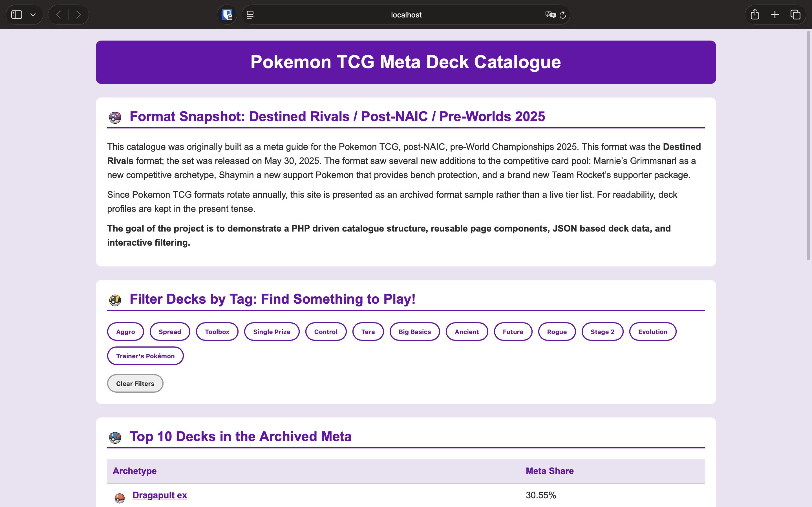
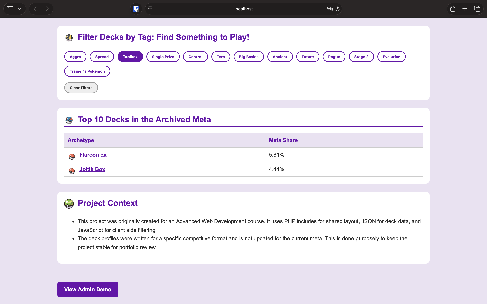
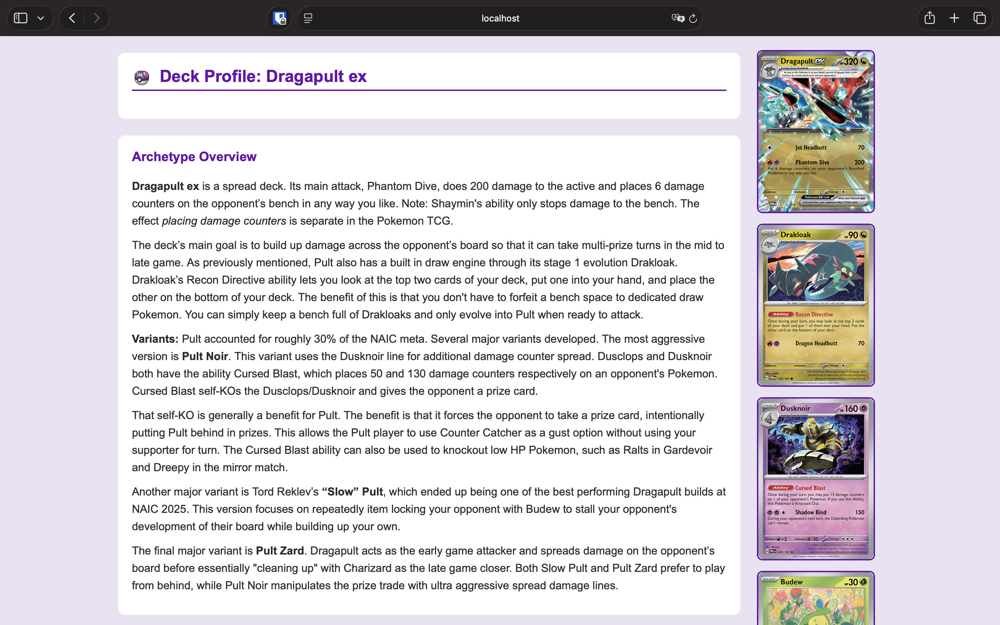
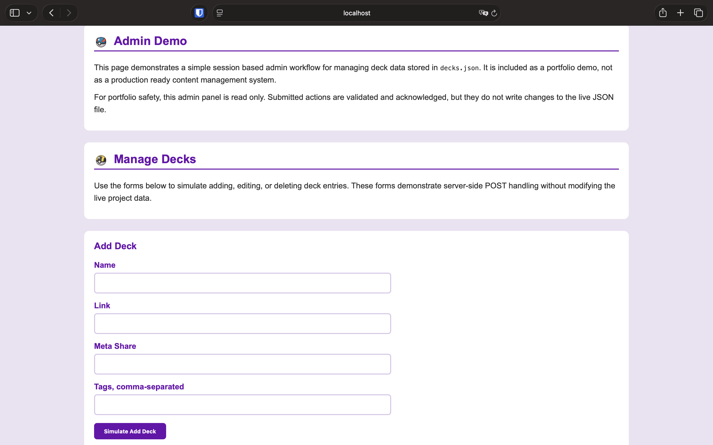

# Pokemon TCG Meta Deck Catalogue

A PHP based web catalogue of competitive Pokemon TCG deck archetypes from the **Destined Rivals / Pre-Worlds 2025** format.

I originally built this site for an Advanced Web Development course and later refined it into a portfolio project. It combines PHP, HTML, CSS, JavaScript, and JSON to present deck data through reusable pages, interactive filtering, responsive layouts, and demonstration form and session handling.

The site is preserved as a snapshot of a past competitive format rather than maintained as a source for the current metagame.

## Screenshots

### Homepage



### Deck Filtering



### Deck Profile



### Admin Demo



## Features

* Top 10 meta deck table populated from JSON data
* Individual deck profile pages
* JavaScript filtering by deck archetype
* Reusable PHP header and footer components
* Responsive layouts for desktop and smaller screens
* Pokemon themed interface and card imagery
* Contact form with client side and server side validation
* Session based admin demonstration
* JSON backed deck data for easier content updates

## Tech Stack

* **PHP** — reusable page components, form processing, and sessions
* **HTML** — page structure and content
* **CSS** — responsive layouts and custom visual design
* **JavaScript** — client side deck filtering and interaction
* **JSON** — structured deck data

## Dynamic Deck Data

The site's Top 10 deck table is generated from `decks.json` rather than being written directly into the page markup.

Keeping the deck information in a separate data file makes the content easier to update and keeps the data separate from its presentation.

JavaScript filtering allows the displayed decks to be narrowed by archetype without requiring a new page request.

## Reusable PHP Components

Shared page elements are separated into `header.php` and `footer.php` rather than duplicated across individual deck pages.

Each deck profile uses the same general layout while presenting its own deck information and card imagery. This keeps the site's structure consistent and reduces repeated markup.

## Forms and Validation

The contact page demonstrates both client side and server side form validation.

The portfolio version validates submitted information but intentionally does not send live email. This preserves the form handling workflow without requiring mail server configuration or external credentials.

## About Admin Demo

The site also includes a small admin demonstration using PHP sessions.

After authentication, the admin interface presents simulated add, edit, and delete actions for deck data. Submitted actions are validated and acknowledged, but the portfolio version does **not** modify `decks.json`.

This keeps the public repository read only while still demonstrating session handling, protected access, and server side form processing.

### Demo password

```text id="33fjqs"
demo123
```

## Archived Format

The deck information represents the **Destined Rivals / Pre-Worlds 2025** competitive format.

Because Pokemon TCG formats change as new sets release and cards rotate, the site is intentionally preserved as an archived snapshot rather than updated to match the current metagame.

Deck profiles use the present tense to describe how each archetype functioned within that format.

## Repository Structure

```text id="tfhwo6"
pokemon-tcg-meta-catalogue/
├── index.php
├── styles.css
├── header.php
├── footer.php
├── contact.php
├── admin.php
├── logout.php
├── decks.json
├── deck-template.php
├── dragapult.php
├── ragingbolt.php
├── gardevoir.php
├── grimmsnarl.php
├── flareon.php
├── gholdengo.php
├── joltik.php
├── zoroark.php
├── toedscruel.php
├── charizard.php
├── images/
│   ├── pokeball.png
│   ├── masterball.png
│   ├── ultraball.png
│   ├── greatball.png
│   └── [deck images]
├── docs/
│   ├── homepage.png
│   ├── filtered-view.png
│   ├── deck-profile.png
│   └── admin-demo.png
└── README.md
```

## Running the Project Locally

Because the site uses PHP includes, sessions, and form handling, it needs to run through a PHP server rather than opening the files directly in a browser.

From the project directory:

```bash id="hdfl1u"
php -S localhost:8000
```

Then navigate to:

```text id="mmbc1z"
http://localhost:8000
```

## Author

J.P. Westerlund
